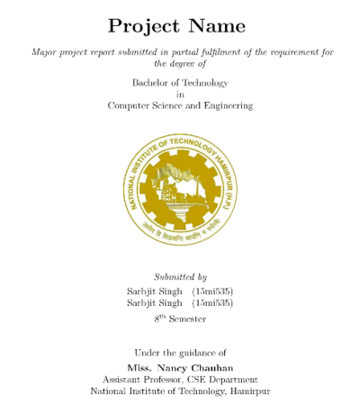
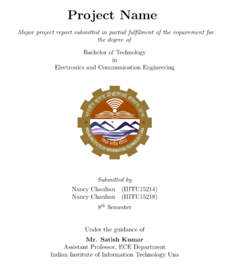

# NITH-IIITU-REPORT

A Repository to hold some standard templates and samples for NITH/IIITU reports.

## Front Page Examples

 

## **Create you own Project report**

  - Fork and Clone the repository

  - You can upload the cloned project on [Overleaf](https://www.overleaf.com) or you can setup the latex environment on your PC. In linux, you can use texMaker or Latexila or do it in commandline by using tools like latexmk or pdflatex

  - You can modify main.tex and references.bib and images folder according to your content.

### About Us

Adapted from [Project Report Template](https://github.com/agathver/cetb-project-report-template) by [Amitosh Swain Mahapatra](https://github.com/agathver) 

Author: [Nancy Chauhan](https://github.com/Nancy-Chauhan/)

Collaborator : [Srb Cheema](https://github.com/srbcheema1/)
